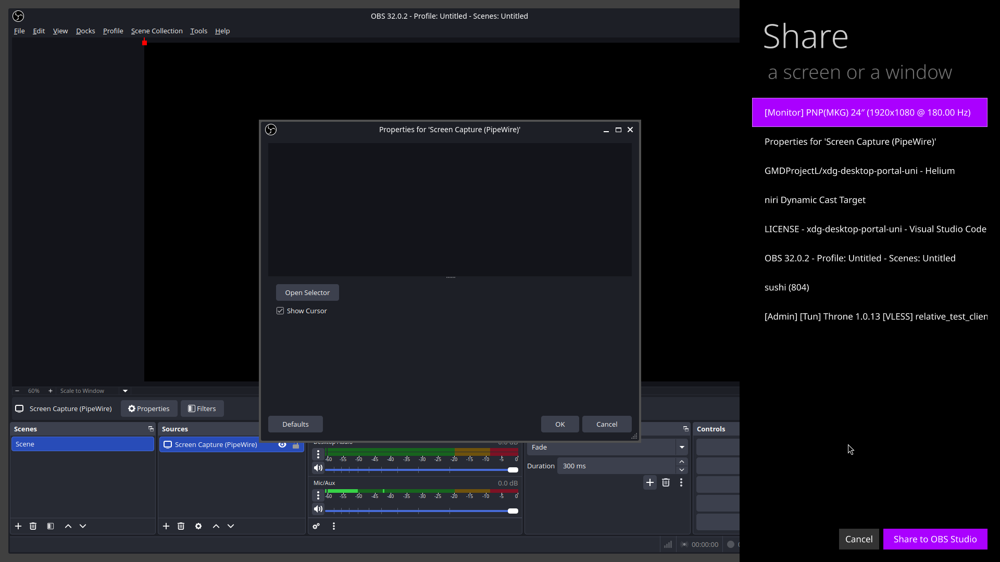

# xdg-desktop-portal-uni

A backend implementation of [xdg-desktop-portal](https://github.com/flatpak/xdg-desktop-portal) for Uni desktop environment and [Niri](https://github.com/YaLTeR/niri) compositor.

This portal features Microsoft's former Modern/Metro/Win8 UI.




## Features

- **ScreenCast interface**: Screen and window capture via PipeWire
- **Native Niri integration**: Uses Niri's D-Bus API for compositor communication
- **Interactive source selection**: Qt-based UI for choosing what to share

## Dependencies

### Build dependencies
- CMake >= 3.19
- C++20 compatible compiler
- Qt6 >= 6.5 (Base, DBus, Widgets, Quick, QuickControls2)
- [unisettings](https://github.com/GMDProjectL/unisettings)
- [UniQmlTk](https://github.com/GMDProjectL/UniQmlTk)

### Runtime dependencies
- qt6-base
- layer-shell-qt
- xdg-desktop-portal
- pipewire
- Niri compositor (or compatible Mutter-like D-Bus API)

## Building

```bash
mkdir build && cd build
cmake ..
cmake --build .
```

## Installation

```bash
sudo cmake --install . --prefix=/usr
```

This will install:
- Binary to `/usr/local/libexec/xdg-desktop-portal-uni`
- Portal configuration to `/usr/local/share/xdg-desktop-portal/portals/uni.portal`
- D-Bus service file for auto-activation
- systemd user service file

## Usage

The portal starts automatically when applications request screen sharing through xdg-desktop-portal.

To manually test:
```bash
/usr/lib/xdg-desktop-portal-uni
```

To check if it's running:
```bash
busctl --user list | grep portal.desktop.uni
```

## Configuration

The portal is automatically selected for `niri` and `uni` desktops. You can configure xdg-desktop-portal by creating `~/.config/xdg-desktop-portal/portals.conf`:

```ini
[preferred]
default=gtk
org.freedesktop.impl.portal.ScreenCast=uni
```

## Architecture

The portal communicates with Niri via its D-Bus screencasting API (basically GNOME Mutter's API) and exposes a standard xdg-desktop-portal ScreenCast interface to applications.

## License

MIT

## Contributing

Please.